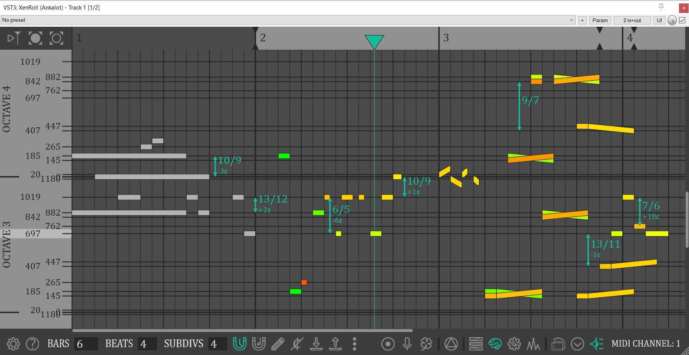

# XenRoll

* XenRoll is a xenharmonic piano roll audio plugin.  
* You can choose pitch of notes with an accuracy of one cent, and there are as many as 1200 cents in an octave (so it's a 1200 EDO piano roll)! 
* You can bend notes independently in a visible way.  
* This plugin has a unique pitch memory model, which helps to understand tonality, stability, and consonance; knowledge of music theory is not necessary.  
* You can import and export tracks.
* You can have several independent instances of this plugin in a single project and view ghost notes from other instances.
* XenRoll is an MTS-ESP master.

## How to get it?
So far there is only a VST3 version for Windows.  
Go to the releases tab and download the archive. There will be instructions inside.

## How to use it?
1. Use a DAW that supports MTS-ESP (e.g., FL Studio, Reaper, Bitwig, etc.).  
2. Place the synth/sampler that is an MTS-ESP client after XenRoll in the FX chain. Don't use any other plugins that are MTS-ESP masters.  

List of synths that definitely work with Xenroll:  
* Serum  
* Serum 2 (with disabled MPE!)  
* Surge XT
 
List of samplers that definitely work with Xenroll:  
* Shortcircuit XT (don't forget to set corresponding midi channel) 

## How to build from source?
You will need JUCE, a C++ compiler, CMake, and the C++ Boost library. You may have to make some adjustments to CMakeLists.txt. You can use `*.bat` scripts.  
To debug the plugin through VS Code and any DAW, configure the .vscode/launch.json file.

## Examples

https://github.com/user-attachments/assets/c6386abf-61fe-4658-8433-8bf898dbd065

https://github.com/user-attachments/assets/ee1b5478-6e9c-4427-8278-5e52f2aa9c88
