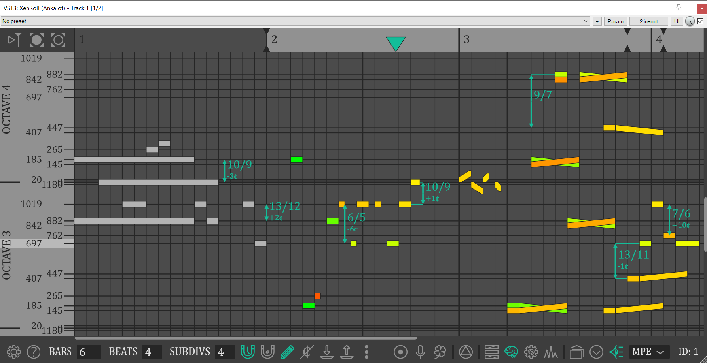

# XenRoll

* XenRoll is a xenharmonic (microtonal) piano roll audio plugin.
* You can choose the pitch of notes with an accuracy of one cent, and there are 1200 cents in an octave (so it's a 1200 EDO piano roll)!
* You can bend notes independently in a visible way.
* This plugin features a unique short-term pitch memory model that shows the tonality, stability, and consonance of notes/keys. It includes two dissonance submodels (with visualization): one based on compactness and the other on partials' beating.
* You can generate notes and/or a pitch curve in real time by singing/humming.
* You can use the keyboard to play and record keys.
* You can display a clock diagram that shows notes, intervals, and chords in real time.
* You can import and export tracks.
* You can have several independent instances of this plugin in a single project and view ghost notes from other instances.
* XenRoll uses either MPE or MTS-ESP (as a master) for microtuning.

&emsp;&emsp;[Video examples](#Examples)

## How to get it?
&emsp;&emsp;So far, only VST3 versions for Windows, Linux, and macOS are available.
Go to the Releases tab and download the corresponding archive. Instructions are included inside.

## How to use it?
&emsp;&emsp;This plugin is intended for use inside a DAW. Place the synth/sampler after XenRoll in the track's FX chain.  
&emsp;&emsp;To control the playhead position via the top panel (with time) in the plugin (which will also move the playhead in the DAW), you need to enable OSC listening on port 8000 in your DAW's settings. Guide for Reaper[^OSC].  
&emsp;&emsp;XenRoll has two tuning modes: **MPE (selected by default)** and MTS-ESP. The tuning mode is the same for all instances of XenRoll in the project; it can be changed in the UI via the combo box at the bottom right. After changing it, you need to ***save and reopen the project*** for the changes to take effect. Many things change depending on the tuning mode, so I ***strongly*** advise you to read at least the first two rows (requirements):
| Property      | MPE                  | MTS-ESP |
| ------------- |----------------------| ------- |
| Suitable DAWs | Almost any | Many popular ones: FL Studio, Reaper, Bitwig Studio, Cubase/Nuendo, Logic Pro, Ableton Live, and others  |
| Synth/sampler requirements and setup | <ul><li>The synth/sampler must support MPE.</li><li>You need to turn on MPE mode in the synth/sampler.</li><li>Make sure that the `MPE pitch bend range` in the synth/sampler matches the one in XenRoll (located in the settings; ±48 semitones by default).</li><li>If the synth/sampler has a setting that limits polyphony to one of any note number, it must be turned off.</li></ul> | <ul><li>The project should not contain any MTS-ESP master plugins other than XenRoll.</li><li>The synth/sampler must support MTS-ESP as a client in continuous mode.</li><li>MPE should be disabled in the synth/sampler.</li><li>Normally, MTS-ESP mode is turned on automatically for synthesizers/samplers, but if it is disabled, turn it on manually.</li><li>The synth/sampler's input channel must match (or contain) the XenRoll instance's channel number (it is shown in the lower right corner of the UI).</li></ul> |
| Compatible with DAW native piano roll | DAW native piano rolls have nothing to do with XenRoll. They work in 12 EDO. | The DAW's native piano roll is unsuitable[^1] for working with the MIDI channels used by XenRoll instances.  |
| Max number of instances | Not limited | 16: one instance per MIDI channel |
| Pitch accuracy | Depends on the `MPE pitch bend range` in XenRoll[^3]. Maximum errors in cents: <ul><li>±12 semitones: ≈0.07¢</li><li>±24 semitones: ≈0.15¢</li><li>±48 semitones (by default): ≈0.29¢</li><li>±96 semitones: ≈0.59¢</li></ul> | The maximum error is less than 1×10⁻¹⁰ cents because the pitch is set using a frequency in Hz as a double-precision floating-point number. |
| Max number of pitches | Not limited, but no more than 15 simultaneously played pitches (because each note uses its own MIDI channel, not including the first one). This can be greatly relaxed[^2]. | 128 different pitches (pitches that match at least one note) |
| Max bend that a note can have | Depends on the `MPE pitch bend range` in XenRoll[^3]; it is ±48 semitones by default, so the default maximum bend range for a note is approximately ±48 (47.5–48.5) semitones. If the `MPE pitch bend range` is set to ±96 semitones, the maximum bend range for a note will be approximately ±96 (95.5–96.5) semitones  | ±10 octaves = ±120 semitones (the full XenRoll pitch range) |
| Single pitch polyphony[^4] | Supported | Not supported (may be added in future versions, but it is unlikely) |

[^OSC]: Go to Options → Preferences... → Control/OSC/web → Add. Set Control surface mode: OSC (Open Sound Control), Mode: Local port, Local listen port: 8000. Apply. Reopen the XenRoll GUI if it is already open.  
[^1]: The pitch of a MIDI note depends arbitrarily on its number. In addition, during the playback of bent notes, XenRoll changes the frequency of the MIDI note in real time.  
[^2]: In `MIDI channels economy mode` (can be enabled in XenRoll settings), simultaneously playing non-bent notes that have the same {pitch mod 100¢} will occupy the same MIDI channel. But if the synth/sampler does not support polyphony on each channel individually in MPE mode, there will be errors!  
[^3]: Don't forget to sync this value with the synth/sampler!  
[^4]: Whether two or more notes with the same pitch (the pitch of a bent note equals its initial pitch) can be played simultaneously.

 

### List of synths/samplers that definitely work with XenRoll:
| Type | Name | Developer | MPE mode, setup | MTS-ESP mode, setup |
|-|-|-|-|-|
| Hybrid Synth | Surge XT | Surge Synth Team | ✅  Enable MPE. | ✅ Disable MPE if enabled. Turn off the 'Menu → MIDI settings → Use MIDI channels 2 and 3 to play scenes individually' setting. |
| Synth (Wavetable) | Serum | Xfer Records | ✅  Enable MPE and turn off the 'limit polyphony to one of any note number' setting. | ✅ Disable MPE if enabled. |
| Hybrid Synth | Serum 2 | Xfer Records | ✅  Enable MPE if it is disabled. | ✅⚠️ (the multi-sampler is problematic: samples are selected not by the nearest frequency, but by the MIDI note number, which is completely independent of frequency)   Disable MPE. |
| Synth (Physical Modeling) | Pianoteq | Modartt | ✅   Set the pitch bend range in the settings equal to the `MPE pitch bend range` in XenRoll settings (by default: ±48 semitones → (-4800, +4800) range). | ❌ |
| Hybrid Sampler | Shortcircuit XT | Surge Synth Team | ✅⚠️(Currently works only (?) with the version of Shortcircuit XT from autumn 2025) Enable MPE in 'PARTS'. Set the 'semi bend range' in the MPE settings equal to the `MPE pitch bend range` in XenRoll settings. | ✅ Set the MIDI channel shown in the bottom right corner of XenRoll in 'PARTS'. |
| Synth (4-bit Wavetable) | Junior | Fors | ✅ | ✅⚠️(bends do not work) |
| Synth (Spectral Warping Wavetable) | Vital | Matt Tytel | ✅ Enable MPE | ❌ |
| Synth (Analogue) | Diva | u-he | ✅ Enable MPE | ❌ |

This is just a list of some synths/samplers that I personally tested. In fact, many more synths/samplers may work with XenRoll.

## How to build from source?
You will need JUCE, a C++ compiler, CMake, and the C++ Boost library. You may have to make some adjustments to CMakeLists.txt. You can use the provided `*.bat`/`*.sh` scripts.  
To debug the plugin through VS Code with any DAW, configure the .vscode/launch.json file.

## Examples

[video1.webm](https://github.com/user-attachments/assets/4a99f3c0-8248-4c2b-8dc9-abed06732c94)

[video2.webm](https://github.com/user-attachments/assets/0655faf6-6d38-49a5-b78e-ec6e880dea08)

## License
This project is licensed under the [GNU General Public License v3.0](LICENSE).
