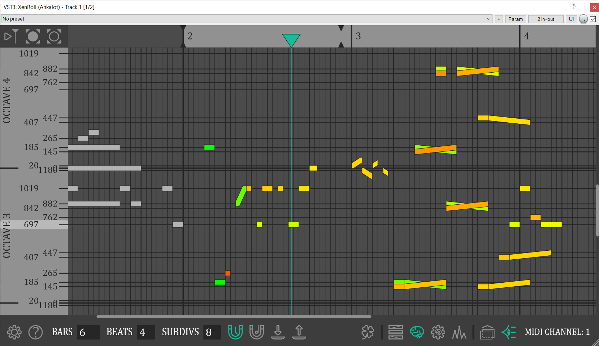

# XenRoll

* XenRoll is a xenharmonic piano roll audio plugin.  
* You can choose the pitch of notes with an accuracy of one cent and there are as many as 1200 cents in an octave (so it's 1200 EDO piano roll)! 
* You can bend notes independently in a visible way.  
* This plugin has a unique pitch memory model, which helps to understand tonality, stability, and consonance, knowledge of music theory is not necessary.  
* You can import and export tracks
* You can have several independent instances of this plugin in single project.
* This plugin is a MTS-ESP master and for it to work, the synthesizer must be an MTS-ESP client (e.g. Serum, Serum 2; DISABLE MPE TO MAKE THEM WORK CORRECTLY!).

## How to get it?
So far there is only a VST3 version for Windows.  
Go to releases tab and download archive. There will be instructions inside.

## How to build from source?
You will need JUCE, c++ compiler, Cmake, c++ boost library. You may have to make some adjustments to CMakeLists.txt. Use can use `*.bat` scripts.  
To debug the plugin through VS Code and any DAW, configure the .vscode/launch.json file.

## Examples

https://github.com/user-attachments/assets/c6386abf-61fe-4658-8433-8bf898dbd065

https://github.com/user-attachments/assets/ee1b5478-6e9c-4427-8278-5e52f2aa9c88

